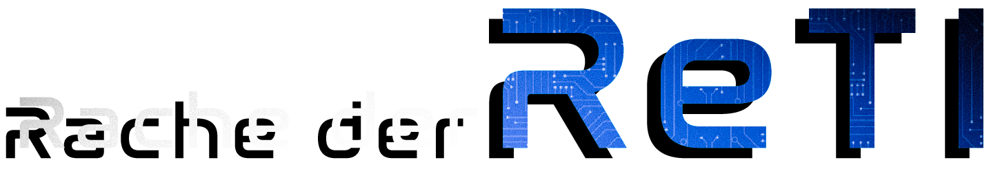

# Willkommen zur der Beta-Version des Spiels

In diesem Dokument finden Sie alle Informationen, die Sie brauchen, um sich einen ersten Eindruck von der Beta [release](https://git.sopranium.de/sopra-ws2223/sopra08/releases) unseres Spiels zu verschaffen. 
Es gibt noch einiges zu tun, aber wir finden, dass das Spiel schon jetzt Spaß macht. :satisfied:

## __Steuerung__
***
### Eine Tabelle mit allen notwendigen Tasten/Mausaktionen, um die Beta-Version zu spielen.
| Aktion | Taste/Maus |
| -------------|-------------|
| Spieler bewegen | Mausklick an einer Stelle, an der sich der Boden der Karte befindet. Den Rest erledigt der PathFinder.
| Fähigkeit benutzen | R-Taste |
| Zoomen | Drehen Sie das Mausrad oder drücken Sie die Tasten I (rein) und O (raus). |
| Menü anhalten | ESC-Taste |
| Zum vorherigen Menü wechseln | ESC-Taste |
| Vollbildmodus einschalten/ausschalten | F5-Taste |

## __Beta Bildschirmfotos__
***
Die Bildschirmfotos zeigen die ersten implementierten Aktionen unseres Spiels.
## Menüs:

  

| _`MainMenue.png` Hauptmenü - Beta Footage_
***

  

| _`SettingsMenue.png` Einstellungs-Menü - Beta Footage_
***
## Animationen/Fähigkeiten:

  

| _`ComputerTransformationAnimation.gif` Computer wird infiziert und verwandelt sich zu Zombie-Rechner  - Beta Footage_
***

  

| _`HackerDiesAnimation.gif` Der Hacker wird von dem Zombie-Computer infiziert und stirbt eines grausamen Todes - Beta Footage_
***

  

| _`WarriorEmpActionAnimation.gif` Der Krieger nutzt den EMP, um sich und seine Freunde kurzzeitig zu schützen - Beta Footage_
***
## Spiel Ende:

  

| _`GameOwer.png` Spielende, nachdem der Krieger und der Hacker tot sind - Beta Footage_